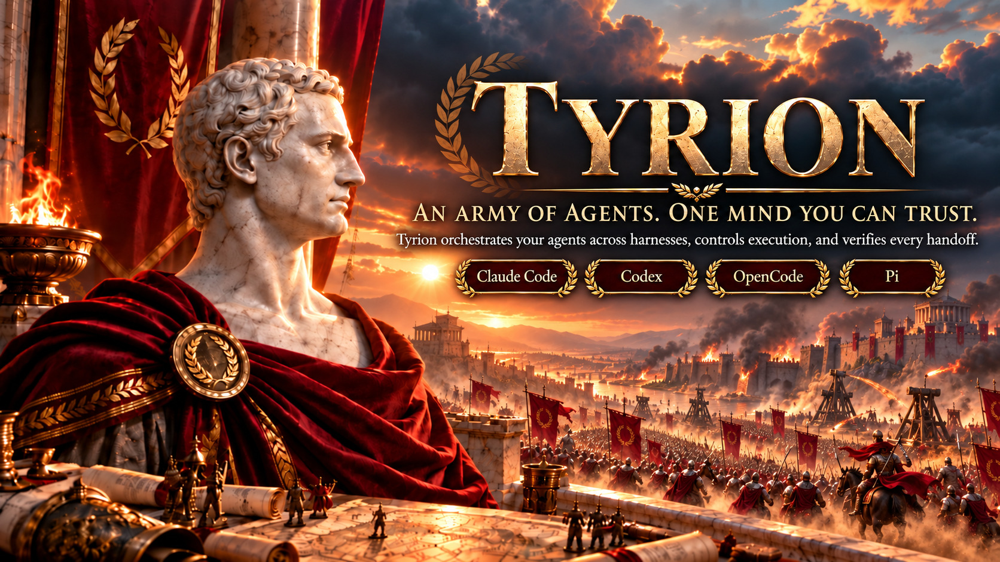

<p align="center">
  
</p>

<p align="center">
  <a href="#get-started"><b>Get started</b></a> &nbsp;·&nbsp;
  <a href="docs/how-it-works.md">How it works</a> &nbsp;·&nbsp;
  <a href="docs/security.md">Security</a> &nbsp;·&nbsp;
  <a href="docs/results.md">Results</a>
</p>

<br>

A coding agent can build a feature in minutes. Ten of them can build a product
in an afternoon, if someone is in command: someone to divide the work, keep the
agents out of each other's way, check everything they bring back, and turn away
anything unproven. Today, that someone is you, watching ten windows at once.

**Tyrion takes command.** Give the order once, in plain words, in the Claude
Code or Codex session you already use. Tyrion plans the work, sends each part
to the agent best suited to it, seals every agent inside its own container,
and checks every result twice. What comes back is one branch, with the proof
attached.

<p align="center"><b>You give the order. Tyrion sees it carried out.</b></p>

<br>

## One order, twenty-one agents

<p align="center">
  
</p>

This is a real run, replayed. One long order became twenty-one pieces of work,
each handed to its own agent, all running at the same time. Every result was
checked on its own, then again once merged, and the whole job came back as one
branch: 21 of 21 checks passed, sixteen times faster than running the agents
one at a time.

You never left the conversation, opened an agent's window, or wrote a line of
configuration.

<br>

<p align="center">
  
</p>

<p align="center"><sub>Measured on a 12-core Mac giving Docker 8 GB, the most agents that machine admits.<br>
Given more, Tyrion admits 48 agents with 16 GB, 64 on 16 cores and 32 GB, and 128 on 32 cores and 64 GB.<br>
<a href="docs/results.md">See how each number was measured.</a></sub></p>

<br>

## How it works

**1. You ask.** In Claude Code or Codex, in your own words:

> Add monthly interest, CSV export, daily limits, and a CLI that uses them.

**2. Tyrion plans.** Independent parts run side by side, and dependent parts
wait for what they need. You approve three things first: the goal, the checks
that will prove it done, and the files agents may touch. Nothing runs until
you do.

**3. Agents build, sealed off.** Each part goes to the harness best suited to
it, inside its own disposable container, holding a copy of your code and
nothing else. Claude Code, Codex and OpenCode work straight after setup; Pi
joins once configured.

**4. Tyrion proves it.** Every result is checked on its own, then again merged
with everyone else's work, each time in a fresh container. When a check fails,
Tyrion retries, reassigns the work, or reconciles the conflict. When it cannot
go on, it tells you the one thing it needs.

Then you review the result like any other change:

```sh
git fetch ~/.local/state/tyrion/integrations/$COMMISSION_ID/repository tyrion-integration
git diff HEAD FETCH_HEAD
git merge --ff-only FETCH_HEAD
```

**Your checkout stays untouched until that last line.** Tyrion builds in a
repository of its own.

## Why you can trust it

**Every agent is sealed.** Each one runs in its own container with:

- a read-only system
- no root and no special privileges
- at most 256 processes, 3 GiB of memory and 2 GiB of files
- no way to reach your home folder, your keys or your checkout

On the network, an agent reaches its own model provider and nothing else. We
tested this by attacking it: 26 attacks inside each of three agents during a
real job, and none got through. [Security](docs/security.md)

**Nothing consequential happens without you.** Writing outside the job or
calling an outside service waits for your approval, given with a credential
only you hold. The approval covers that exact action; change one byte and it
no longer applies.

**It learns how you build.** Record a preference for a project once, such as
"Give every public function a one-line docstring.", and every agent that later
works on that project receives it. The final report shows which agents
received it and whether their work was accepted.

**Every job leaves a record.** One checksummed file holds what you approved,
where each part went and why, and every check, approval and recovery. It never
certifies itself; the judgement stays yours. [Results](docs/results.md)

## Get started

You need macOS, and Docker Desktop or Colima with at least 2 CPUs and 8 GB of
memory. You also need a login for Claude Code, Codex, or both.

```sh
brew tap aneesh-sathe/tyrion https://github.com/aneesh-sathe/tyrion
brew install tyrion
tyrion init
```

`tyrion init` does the setup you would otherwise do by hand. It:

- builds the image your agents run in
- downloads each harness and checks it against its publisher's checksum
- proves each harness runs inside the sealed container
- starts Tyrion on the result

It spends no model tokens, and it is safe to run again.

```
  1/7  docker            Docker version 28.0.4, build b8034c0 (linux/arm64, 12 CPUs, 7.7 GiB)
  2/7  worker image      sha256:8973468e9c7b (built, harnesses built in)
  3/7  claude code       2.1.277 (Claude Code) (downloaded, checksum verified)
  4/7  codex             codex-cli 0.156.1 (downloaded, checksum verified)
  5/7  opencode          1.18.32 (downloaded, checksum verified)
  6/7  configuration     ~/.local/state/tyrion/runtime/worker-runtime.json
  7/7  daemon            started on this runtime, Entry Session attached (0.5s)

  capacity          21 Codex Workers at once (320 MiB expected each, 3 GiB ceiling)
  claude workers    on, authenticated by CLAUDE_CODE_OAUTH_TOKEN
  codex workers     on, authenticated by ~/.codex/auth.json
  opencode workers  on, authenticated by ~/.codex/auth.json

Tyrion is ready. From any Git repository, run `tyrion claude` or `tyrion codex`.
```

Agents sign in separately from you:

- **Codex:** run `codex login`.
- **OpenCode:** nothing extra; it uses your Codex login.
- **Claude:** run `claude setup-token`, then export the result as
  `CLAUDE_CODE_OAUTH_TOKEN`.

Run `tyrion init` again after adding one. Then, from any Git repository:

```sh
tyrion claude     # or: tyrion codex
```

Your usual harness opens with Tyrion attached. Describe the job.

## Where the limits are

- **Agents are separated by containers, not virtual machines.** On macOS,
  Docker's virtual machine protects your Mac. Agents running side by side are
  only as far apart as containers are.
- **Tyrion does not cap your spending.** No harness offers a hard spending
  limit, so Tyrion reports cost instead of pretending to enforce it. Set your
  cap with your model provider.
- **It runs on one machine, for one person.** It is not a hosted service or a
  team product.
- **It does not replace your review.** It proves what your checks prove, and
  choosing the checks is still your job.
- **Two controls still need the command line.** Approving an action outside
  the job and recording a preference use `tyrion` directly; your harness
  session cannot ask for them yet.

## Why "Tyrion"

Empires are remembered for their rulers, but the ones that lasted had an
adviser the ruler could trust: someone who knew what to delegate, whom to rely
on, and what to check before it reached the throne. Tyrion is that adviser for
your code.

## For contributors

Tyrion is written in Rust: a daemon, `tyriond`, and a command-line tool,
`tyrion`, talking over a local socket, with SQLite as the single source of
truth.

```sh
cargo fmt --check
cargo clippy --all-targets --all-features -- -D warnings
cargo test
```

The tests run against stand-ins for Docker and each harness, rebuilt whenever
the real ones behaved differently. Stand-ins are a convenience, not evidence:
the first real runs found defects that a fully passing suite had missed, so
every claim above comes from a run with real models in real containers. Start
with [the docs](docs/README.md).

## License

[MIT](LICENSE)
