<p align="center">
  
</p>

<p align="center">
  <a href="#get-started"><b>Get started</b></a> &nbsp;·&nbsp;
  <a href="docs/how-it-works.md">How it works</a> &nbsp;·&nbsp;
  <a href="docs/security.md">Security</a> &nbsp;·&nbsp;
  <a href="docs/proof/README.md">Proof</a>
</p>

<br>

<h3 align="center">Coding agents are brilliant. One at a time.</h3>

<p align="center">
  Give one a job and it writes the code. Give ten the same afternoon, and you become their manager.<br>
  You split the work, watch every window, untangle their collisions, and read every line yourself,<br>
  because an agent saying <i>done</i> tells you nothing about whether it is.
</p>

<p align="center"><b>That is not engineering at scale. That is babysitting.</b></p>

<br>

<p align="center">Today, we are introducing three things.</p>

<p align="center"><b>A foreman.</b> It turns one sentence into a plan,<br>and the plan into a crew of coding agents working at the same time.</p>

<p align="center"><b>An inspector.</b> It trusts nothing an agent says,<br>and checks every result twice, in rooms the agent has never touched.</p>

<p align="center"><b>A vault.</b> It keeps every agent sealed away<br>from your machine, your keys and your code.</p>

<br>

<p align="center">
  <b>A foreman. An inspector. A vault.</b><br>
  <b>A foreman. An inspector. A vault.</b><br>
  <br>
  <i>Are you getting it?</i>
</p>

<br>

<h3 align="center">These are not three separate products.<br>This is one, and we call it Tyrion.</h3>

<br>

## One sentence in

<p align="center">
  
</p>

That is a real run, replayed. Someone typed one sentence. Tyrion split it into
four pieces of work and gave them to two different agent harnesses, OpenCode
and Codex. It held back the one piece that depended on the others, checked
every result on its own, and checked them all again once merged. Then it
handed back one branch.

You stay in the conversation you already have. You never open a Worker window.
You never write a line of configuration.

<br>

<p align="center">
  
</p>

<p align="center"><sub>Every number comes from a recorded run. <a href="docs/proof/README.md">See the proof.</a></sub></p>

<br>

## How it works

**1. You ask.** In Claude Code or Codex, in your own words:

> Add monthly interest, CSV export, daily limits, and a CLI that uses them.

**2. Tyrion plans.** Independent parts run at once; dependent parts wait for
what they need. You approve the goal, the checks that will prove it done, and
the files agents may touch. Nothing runs before you do.

**3. Agents build, sealed.** Each piece goes to the harness that fits it best,
inside its own disposable container, with a copy of your code and nothing
else. Claude Code, Codex and OpenCode are ready after setup, and Pi works the
same way once configured.

**4. Tyrion proves it.** Every result is checked on its own, then checked again
merged with everyone else's work, each time in a fresh container. When a check
fails, Tyrion retries, reroutes or reconciles. When it cannot proceed, it tells
you the one thing it needs.

Then you review it like any other change:

```sh
git fetch ~/.local/state/tyrion/integrations/$COMMISSION_ID/repository tyrion-integration
git diff HEAD FETCH_HEAD
git merge --ff-only FETCH_HEAD
```

**Your checkout does not change until you run that last line.** Tyrion builds
in a repository of its own, never yours.

## Built on proof, not promises

**Sealed rooms.** Every agent runs in its own container. It has:

- a read-only system
- no root and no capabilities
- 256 processes, 3 GiB of memory and 2 GiB of files at most
- no path to your home, your keys or your checkout

On the network, it reaches its own model provider and nothing else. This was
not described but attacked: 26 attacks inside each of three live agents during
a real job, and none got through. [Security](docs/security.md)

**Nothing consequential without you.** Writing outside the job or calling an
outside service waits at an approval gate. You approve the exact action, with
a credential only you hold. Change one byte and the approval no longer
applies.

**It learns how you build.** Record a preference for a project once, such as
"Give every public function a one-line docstring.", and every later agent on
that project receives it. The final report shows who received it, and whether
their work was accepted.

**A record you can check.** Every job exports as one checksummed record:

- what you approved
- where each piece went and why
- every check, every approval, every recovery

It never certifies itself. The judgement stays with you.
[Proof](docs/proof/README.md)

## Get started

You need macOS and Docker Desktop or Colima, with at least 2 CPUs and 8 GB of
memory for Docker. You also need a login for Claude Code, Codex, or both.

```sh
brew tap aneesh-sathe/tyrion https://github.com/aneesh-sathe/tyrion
brew install tyrion
tyrion init
```

`tyrion init` does everything you would otherwise do by hand:

- It builds the image your agents run in.
- It downloads each harness and checks it against its publisher's checksum.
- It proves each one runs inside the sealed container.
- It starts Tyrion on the result.

It spends no model tokens, and it is safe to rerun.

```
  1/7  docker            Docker version 28.0.4, build b8034c0 (linux/arm64, 12 CPUs, 7.7 GiB)
  2/7  worker image      sha256:8973468e9c7b (built, harnesses built in)
  3/7  claude code       2.1.277 (Claude Code) (downloaded, checksum verified)
  4/7  codex             codex-cli 0.156.1 (downloaded, checksum verified)
  5/7  opencode          1.18.32 (downloaded, checksum verified)
  6/7  configuration     ~/.local/state/tyrion/runtime/worker-runtime.json
  7/7  daemon            started on this runtime, Entry Session attached (0.5s)

  capacity          21 Codex Workers at once (320 MiB expected each, 3 GiB ceiling)
  claude workers    on, authenticated by CLAUDE_CODE_OAUTH_TOKEN
  codex workers     on, authenticated by ~/.codex/auth.json
  opencode workers  on, authenticated by ~/.codex/auth.json

Tyrion is ready. From any Git repository, run `tyrion claude` or `tyrion codex`.
```

Agents sign in separately from you:

- **Codex:** run `codex login`.
- **OpenCode:** nothing extra. It uses your Codex login.
- **Claude:** run `claude setup-token`, then export the result as
  `CLAUDE_CODE_OAUTH_TOKEN`.

Rerun `tyrion init` after adding one. Then, from any Git repository:

```sh
tyrion claude     # or: tyrion codex
```

That is your normal harness, with Tyrion attached. Describe the job.

## What it does not claim

Trust is earned by saying exactly where the edges are.

- **Agents are separated by container walls, not virtual machines.** On macOS,
  Docker's virtual machine protects your Mac, but agents running side by side
  are only as far apart as containers are.
- **Tyrion does not cap what you spend.** No harness offers a hard spending
  limit, so Tyrion reports cost rather than pretend to enforce it. Set the cap
  at your model provider.
- **It is local.** One person, one machine, one daemon. It is not a hosted
  service or a team product.
- **It does not replace your review.** It proves what the checks prove. You
  still decide what the checks should be.
- **Some controls still live on the command line.** Approving an action outside
  the job and recording a learned preference use `tyrion` directly today; your
  harness session cannot yet ask for either.

## Why "Tyrion"

Behind every great ruler stood an adviser who actually ran the kingdom. They
knew what to delegate, whom to trust, and what to check before it ever reached
the throne. You are the ruler. Tyrion runs the kingdom.

## For contributors

Tyrion is Rust: a daemon, `tyriond`, and a command-line tool, `tyrion`, over a
local socket, with SQLite as the single source of truth.

```sh
cargo fmt --check
cargo clippy --all-targets --all-features -- -D warnings
cargo test
```

The test suite runs against fakes of Docker and of each harness, rebuilt
whenever the real ones behaved differently. The fakes are a convenience, not
evidence. The first real runs found defects no
green suite could see, so every claim above comes from a run with real models
in real containers. Start with [the docs](docs/README.md).

## License

[MIT](LICENSE)

<sub>Tyrion is an independent open-source project. It is not affiliated with,
sponsored by, or endorsed by HBO, Warner&nbsp;Bros.&nbsp;Discovery, or George&nbsp;R.&nbsp;R.&nbsp;Martin.</sub>
